# UberGui V4 ( TD 2021.12380 )

  

**UberGui is a lightweight multi-threaded, webRender UI module for [TouchDesigner](https://derivative.ca/) projects.** The aim is to solve the trifecta of challenges building UI's in TouchDesigner often poses: being fast, feature rich, and visually appealing.

Additionally, UberGui is built as a layer of abstraction directly on top of Custom Parameters, so you can use this in existing projects with little to no additional refactoring.

## Fast, Beautiful, with TouchDesigner-centric features.

### Performance
UberGui uses the webRender TOP in TD which runs a separate threaded instance of an embedded chromium browser. You can spawn many UG UI's and each will run independently of the main TouchDesigner TOE. Keeping your UI's from bogging down your real-time projects.

Both real time performance when many parameters are animated AND the speed in which a totally new ui is generated is very fast.

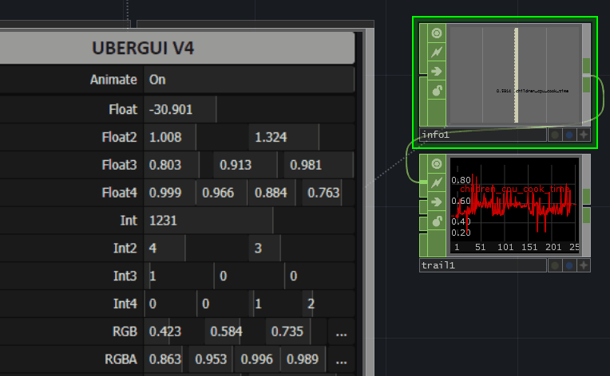

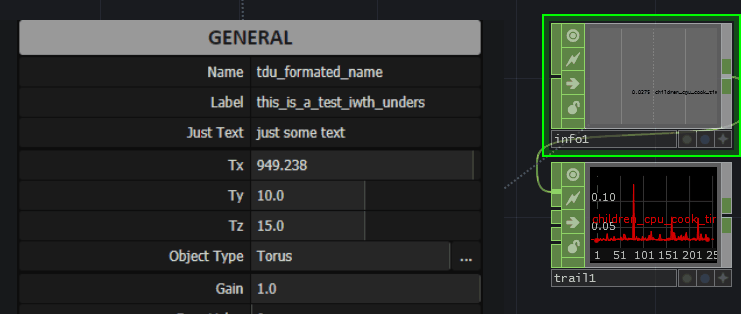

Resting performance is very low, just the cost of the web render TOP. **NOTE:** *You can even disable the "Enable Thread" parameter, when you want to fully shut down the cook times of UG, for example when a certain window is not open, or part of the software not visible.*

### Aesthetic
Since UberGui is built on html/css we have a massive array of pre existing tech and styling options to leverage to build out compelling UIs. For this tool, I've exposed many of these css styling variables to TD, through a custom parameter styles page. You can modify/expose as many others as you'd like very easily with the parameter injection find/replace method.

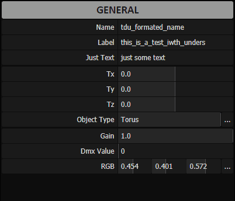

You can also change the horizontal alignment of several elements from the styles page.

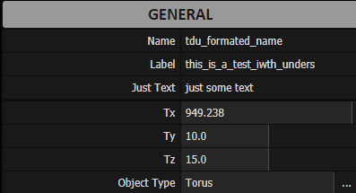

### Features
UberGui is built to layer directly on top of existing projects that utilize Custom Parameters, and is intended to be a visual and functional extension of that feature set in TouchDesigner.

That said, it does offer many additional ways to manipulate and set numerical values that can speed up workflows and improve the experience greatly. Those features are covered below.

## Using UberGui

### Initial Setup
The fastest way to get going is to just download the Tox file in this repo, and drag it into your project. If you haven't used UberGui before, I suggest cloning the entire repo or downloading a zip file, and opening the **UberGui_V4_Release.toe** file to see how to use it with examples.

### Input Mode

UberGui supports operation via **mouse**, and via **touchscreen**. **Switching is handled automatically** in the background, so you can switch between them seamlessly.

### Page Filtering

UberGui by default is looking for any custom parameter pages on your source object. If you have some custom pages you wish to have visible, and others not - you can use the other page filtering mode in the config page, which will only show pages named with all upper case characters.

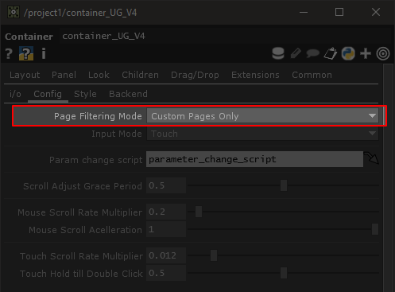

### Scroll Speed

If scrolling or touch interactions are too fast or too slow, you can change the speed and acceleration below:

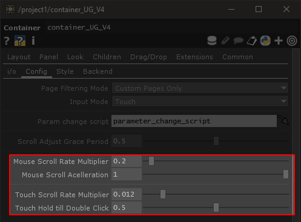

---

### Adjusting Values via Sliders
You can adjust the value of any type of numerical parameter just dragging left and right. The min/max ranges of the parameter will determine the range. Menu parameters can also be treated like a slider.

---

### Manual Entry via Field
**Double clicking** on any field will launch an editable field that you can type values into. Most parameters have this ability, but some do not (*like the Menu parameter*).

You may also **tab to next** for quick entry of several values either in a parameter tuple row or simply down the line. Each tab press will launch a field in the next parameter, if it supports a field.

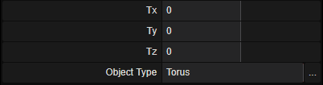

You can also **left click on any label**, to automatically enter field entry mode for it's parameter (*if supported*).

You can also type in **valid python expressions** (*in TD math is imported by default for us*).
These will not be set to the TD expression mode of the parameter, it will simply be evaluated when set.

You are able to **evaluate** expressions using many of the **common measurement units** as well (*the assumed default unit cm*).

---

### Scroll Wheel
Depending on where your mouse is inside the UI, the scroll wheel will perform one of two functions generally.

When **scrolling inside a parameter** slider on the right half of the UI, it will **adjust the parameter** value in increments ( **ctrl** *and* **shift** *will scale the increments accordingly* )

When **scrolling on the left side** of the UI, this will **scroll vertically** through your UI if there is a scroll bar.

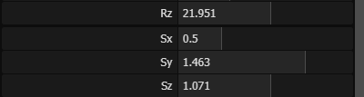

---

### Parameter Reset
**Right Clicking** on any parameter label will **reset the value** to it's TD parameter set default.

---

### Auxiliary UI
**Menu and Color parameters** have special auxiliary UI that will launch over top of UberGui to make it easier to choose a value. You'll see the **triple dot icon** to the right when this is the case. (*file and folder parameters use this icon as well, but they simply launch TouchDesigner's built in picker.*)

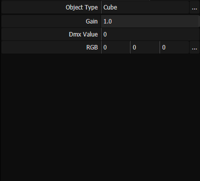

You can take advantage of the tool-tips overlay, if you include a table DAT in the source object, that contains descriptions of each parameter.

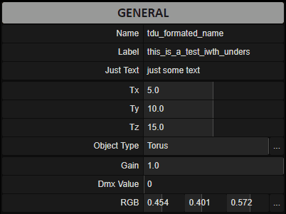

This is also where you'd specify special functionality for certain types of parameters in the third and fourth columns.

---

### Touch Screen support

Touch Screens are supported as well, switching happens automatically as you use different inputs.

Scrolling is easy, just drag up and down on the left side of UberGui. You can also use the scrollbar in touch screen mode.

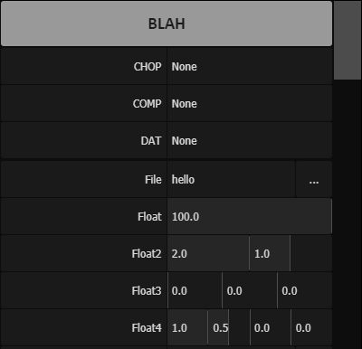

Using a slider is simple, just drag left or right.

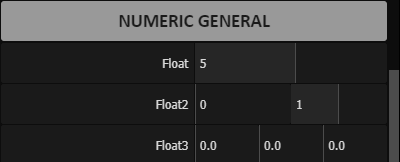

To reset a parameter tuplet to it's default value(s), just long press on the label.
**NOTE:** *You can change the global delay for long press in the config page of UG.*

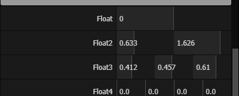

To enter field mode, just quickly tap any field, or tap the parameter name to the left.

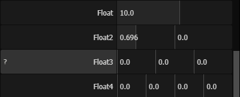

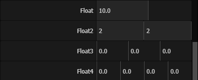

---

### Other Features

Parameters that have read only enabled, or who's parameter mode is set to expression, export, or bind will show as follows, and not be editable via UberGui with the exception of Bound parameters.

Disabled parameters will simply be excluded from the UI all together.

## Support this work

If you find value in this sort of thing, help me dedicating time to making open source code.

